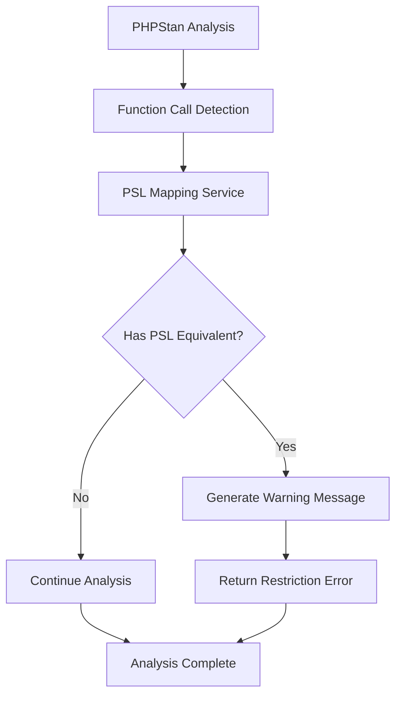

# Design Document

## Overview

This design outlines the implementation of a PHPStan extension that suggests azziez/psl (PHP Standard Library) replacements for native PHP functions. The extension will implement PHPStan's `RestrictedFunctionUsageExtension` interface to analyze function calls during static analysis and provide helpful warnings when PSL alternatives are available.

The core approach involves maintaining a comprehensive mapping of native PHP functions to their PSL equivalents, then using PHPStan's extension system to detect usage of these native functions and suggest the PSL alternatives with friendly, actionable messages.

## Architecture

### High-Level Architecture



### Component Structure

The extension will follow a modular design with clear separation of concerns:

1. **Extension Entry Point**: Implements `RestrictedFunctionUsageExtension` and handles message generation
2. **Function Mapping Service**: Manages the native-to-PSL function mappings

## Components and Interfaces

### 1. PslSuggestionsExtension (Main Extension Class)

```php
final readonly class PslSuggestionsExtension implements RestrictedFunctionUsageExtension
{
    public function __construct(
        private FunctionMappingService $mappingService
    ) {}
    
    public function getRestrictedFunctions(): array;
    public function getRestrictionError(FuncCall $funcCall, Scope $scope): ?string;
    private function generateSuggestionMessage(string $nativeFunction, string $pslFunction): string;
}
```

**Responsibilities:**
- Implement PHPStan's `RestrictedFunctionUsageExtension` interface
- Coordinate with mapping service for function lookups
- Return list of restricted (native) functions
- Generate restriction errors and warning messages for detected function calls

### 2. FunctionMappingService

```php
final readonly class FunctionMappingService
{
    public function __construct(private array $functionMappings) {}
    
    public function getRestrictedFunctions(): array;
    public function getPslEquivalent(string $nativeFunction): ?string;
    public function hasPslEquivalent(string $nativeFunction): bool;
}
```

**Responsibilities:**
- Store and manage native-to-PSL function mappings
- Provide lookup functionality for PSL equivalents
- Return list of all native functions that have PSL alternatives

### 3. Function Mappings Data Structure

The function mappings will be stored as a comprehensive array covering major PHP function categories:

```php
private const FUNCTION_MAPPINGS = [
    // String functions
    'strlen' => 'Psl\Str\length',
    'substr' => 'Psl\Str\slice',
    'strpos' => 'Psl\Str\search',
    'str_replace' => 'Psl\Str\replace',
    'strtolower' => 'Psl\Str\lowercase',
    'strtoupper' => 'Psl\Str\uppercase',
    'trim' => 'Psl\Str\trim',
    'ltrim' => 'Psl\Str\trim_left',
    'rtrim' => 'Psl\Str\trim_right',
    'str_split' => 'Psl\Str\chunk',
    'implode' => 'Psl\Str\join',
    'explode' => 'Psl\Str\split',
    
    // Array functions
    'array_map' => 'Psl\Vec\map',
    'array_filter' => 'Psl\Vec\filter',
    'array_reduce' => 'Psl\Vec\reduce',
    'array_keys' => 'Psl\Dict\keys',
    'array_values' => 'Psl\Dict\values',
    'array_merge' => 'Psl\Dict\merge',
    'array_slice' => 'Psl\Vec\slice',
    'array_chunk' => 'Psl\Vec\chunk',
    'count' => 'Psl\Vec\count',
    'in_array' => 'Psl\Vec\contains',
    
    // Math functions
    'abs' => 'Psl\Math\abs',
    'max' => 'Psl\Math\max',
    'min' => 'Psl\Math\min',
    'round' => 'Psl\Math\round',
    'ceil' => 'Psl\Math\ceil',
    'floor' => 'Psl\Math\floor',
    
    // Type functions
    'is_string' => 'Psl\Type\string',
    'is_int' => 'Psl\Type\int',
    'is_array' => 'Psl\Type\vec',
    'is_bool' => 'Psl\Type\bool',
    
    // File functions
    'file_get_contents' => 'Psl\File\read',
    'file_put_contents' => 'Psl\File\write',
    
    // Encoding functions
    'base64_encode' => 'Psl\Encoding\Base64\encode',
    'base64_decode' => 'Psl\Encoding\Base64\decode',
    'json_encode' => 'Psl\Json\encode',
    'json_decode' => 'Psl\Json\decode',
];
```

## Data Models

### Function Mapping Model

The function mappings will be represented as a simple associative array where:
- **Key**: Native PHP function name (string)
- **Value**: Corresponding PSL function name with full namespace (string)

### Warning Message Model

Warning messages will follow this structure:
- Clear identification of the native function being used
- Specific PSL alternative recommendation
- Brief explanation of the benefit
- Consistent formatting with PHPStan conventions

Example message format:
```
"Consider using Psl\Str\length() instead of strlen() for better type safety and consistency."
```

## Error Handling

### Function Call Context Detection

The extension must handle various contexts where function calls might occur:

1. **Global Function Calls**: Direct calls to native functions
2. **Namespaced Contexts**: Ensure we're detecting actual native PHP functions, not namespaced alternatives
3. **Function References**: Handle cases where functions are referenced but not called
4. **Dynamic Function Calls**: Variable function calls that might not be detectable

### Edge Cases

1. **False Positives Prevention**:
   - Check if function is called in global namespace
   - Verify it's actually a native PHP function
   - Avoid flagging user-defined functions with same names

2. **Performance Considerations**:
   - Use efficient lookup mechanisms for function mappings
   - Minimize overhead during PHPStan analysis
   - Cache mapping data appropriately

## Testing Strategy

### Unit Testing Approach

1. **FunctionMappingService Tests**:
   - Test mapping lookup functionality
   - Verify all expected native functions are covered
   - Test edge cases for unknown functions

2. **PslSuggestionsExtension Tests**:
   - Test integration with PHPStan's extension system
   - Verify correct restriction errors are generated
   - Test function call detection accuracy
   - Verify message format consistency and content accuracy

### Integration Testing

1. **PHPStan Integration Tests**:
   - Test extension registration and loading
   - Verify warnings appear in PHPStan output
   - Test with various PHP code samples

2. **Real-world Code Testing**:
   - Test against actual PHP codebases
   - Verify no false positives in common scenarios
   - Ensure performance impact is minimal

### Test Data Strategy

Create comprehensive test fixtures covering:
- All mapped native functions
- Various function call contexts
- Edge cases and boundary conditions
- Performance benchmarks

## Implementation Phases

### Phase 1: Core Infrastructure
- Implement basic extension structure
- Create function mapping service
- Set up PHPStan extension registration

### Phase 2: Function Detection
- Implement function call analysis
- Add restriction error generation
- Create message formatting

### Phase 3: Comprehensive Mappings
- Research and map all relevant PSL functions
- Organize mappings by category
- Validate mapping accuracy

### Phase 4: Testing & Refinement
- Implement comprehensive test suite
- Performance optimization
- Edge case handling

This design provides a solid foundation for implementing a robust PSL suggestion system that integrates seamlessly with PHPStan while providing valuable guidance to developers adopting the PSL library.